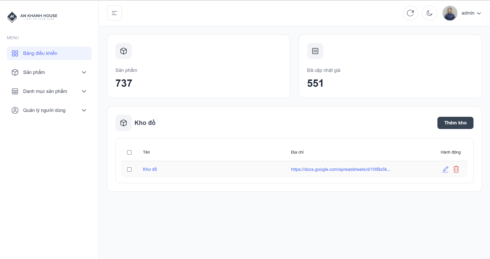
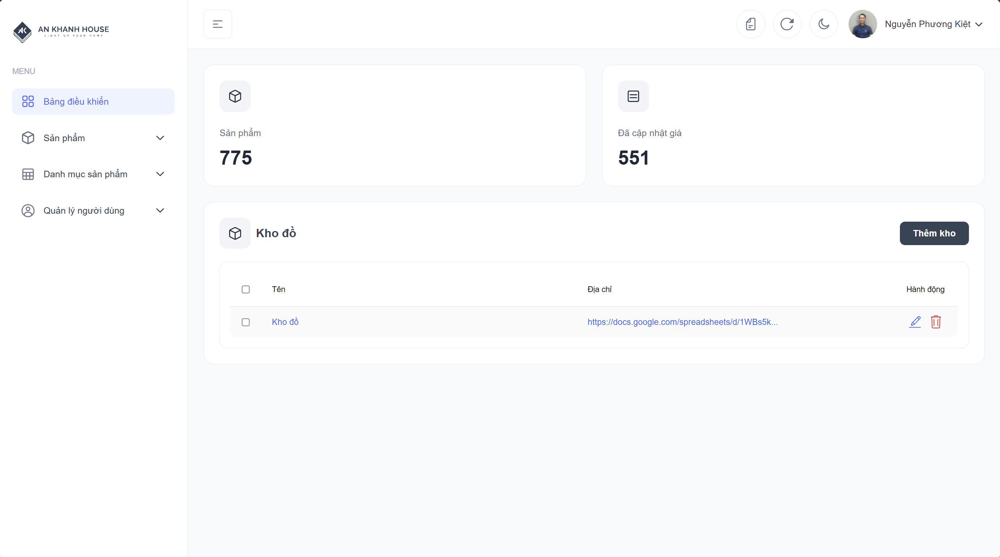

# An Khánh Data Management - Webapp quản lý dữ liệu sản phẩm nội bộ



## Khái quát

An Khánh Data Management là website dùng để quản lý các sản phẩm của Công ty gạch An Khánh, bao gồm các chức năng:

### Sản phẩm
- Tạo mã hàng, cập nhật mã hàng, nhập excel vào database, chỉnh sửa giá tiền, chỉnh sửa giá tiền hàng loạt, cập nhật excel vào mã hàng,...

### Danh mục sản phẩm
- Thêm, xóa, sửa các danh mục sản phẩm

### Người dùng
- Thêm, sửa, chặn, bỏ chặn người dùng

### Các service ngoài
- Brevo (Gửi email)
- Google Drive API (Truy cập Google Drive để chỉnh sửa hoặc xem file)
- AWS (Deploy (Tạm thời))

### Truy cập nhanh
- [Trang chủ](https://data.gachankhanh.com)

## Cài đặt

### Điều kiện tiên quyết

Để bắt đầu chỉnh sửa code, chắc chắn rằng bạn phải làm theo những điều kiện tiên quyết này được tải và setup:

- Node.js 18.x hoặc phiên bản sau này (recommended dùng Node.js 20.x hoặc phiên bản sau này)

### Clone lại repository về máy

Clone repository bằng lệnh sau:

```bash
git clone https://github.com/phuongkiet/ak-data-management-client.git
```

> Windows Users: đặt repository gần thư mục root của drive nếu bạn gặp vấn để khi clone.

1. Install dependencies:

   ```bash
   npm install
   # or
   yarn install
   ```

   > Dùng  `--legacy-peer-deps` flag, nếu bạn gặp vấn để khi clone.

2. Khởi động server development:
   ```bash
   npm run dev
   # or
   yarn dev
   ```

## Change Log
### Version 1.0


### Version 1.01

- Thêm các chức năng như:
  + Tạo excel report gửi qua gmail, thêm các dữ liệu vào metadata để tối ưu hiệu suất và giảm số lần gọi API
  + Tùy chỉnh lại các bảng danh mục
  + Supplier (Nhà cung cấp) được điều chỉnh lại để có thể sửa -> Hiển thị các giá cần thiết cho bảng tính giá
  + Thêm chức năng xem cho SAPO
  + Thêm thiết lập cho quản trị viên để điều chỉnh Mail nhận bên Gmail, Mail được CC, các FileId của Google Drive
  + ... sẽ update thêm

## License

TailAdmin React.js Free Version is released under the MIT License.

## Support

If you find this project helpful, please consider giving it a star on GitHub. Your support helps us continue developing
and maintaining this template.
